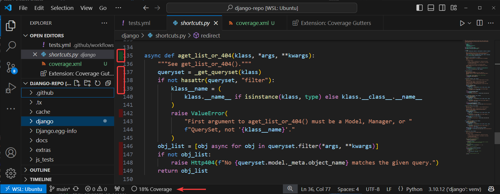
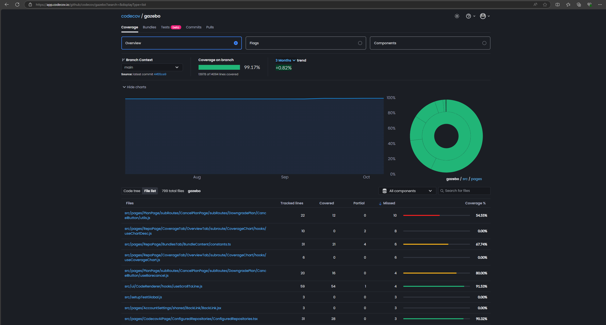
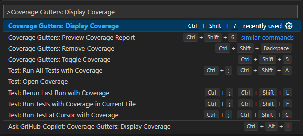
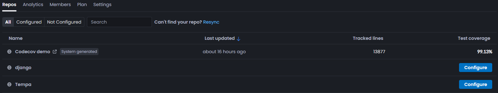
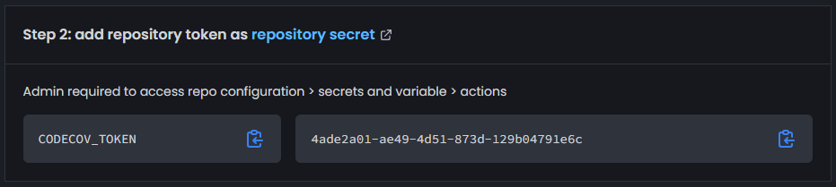
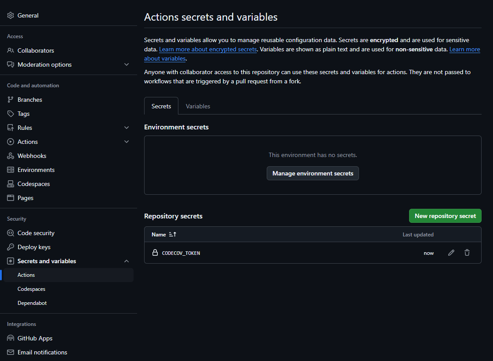
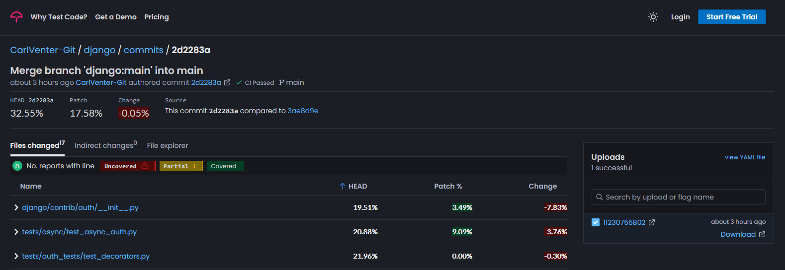

# Create and view coverage reports in VSCode

This guide will walk you through setting up and viewing code coverage reports in Visual Studio Code (VS Code). You will learn how to view code coverage in your editor and set up continuous monitoring of coverage metrics.

We will use the [Django](https://www.djangoproject.com/) web framework [repository](https://github.com/django/django) as an example, which already has tests suites and coverage reports set up.

It will also show you how to add functionality to these code coverage tools by using a few more resources:

**[Coverage Gutters:](https://marketplace.visualstudio.com/items?itemName=ryanluker.vscode-coverage-gutters)** A VS Code extension that displays code coverage information directly in your editor, showing which lines are covered by tests and which are not.

  

**[Codecov:](https://about.codecov.io/)** A tool that tracks code coverage over time, integrates with your CI/CD pipeline, and helps share coverage reports with your team.



By the end of this guide, you will:

* Be able to generate a code coverage report and understand its meaning
* Set up local coverage views using Coverage Gutters in VS Code
* Integrate Codecov with your GitHub Workflows to track and enforce coverage metrics

Basic Steps

* Clone the repository
* Set up a Python virtual environment and install dependencies
* Install run tests with coverage
* Generate a coverage report
* Set up Coverage Gutters in VS Code
* Integrate Codecov for centralized reporting and CI/CD

## Clone Repository

In a terminal, clone the forked Django repo:

```bash
git clone https://github.com/<YourGitHubName>/django.git django-repo
```

Navigate into the newly cloned repository:

```bash
cd django-repo
```

### Install Packages

Create a new virtual environment:

```bash
python -m venv ~/venvs/django
```

Activate the virtual environment:

```bash
source ~/venvs/django/bin/activate
```

Ensure packages are installed by running:

```bash
pip install -e .
```

Otherwise ensure that all required packages to run the tests in your repository are installed.

### Install Test Dependencies

Install the test dependencies with:

```bash
pip install -r tests/requirements/py3.txt
```

### Install Coverage

Additionally, install the `coverage` package, which will generate the coverage reports:

```bash
pip install coverage
```

### Run Tests with Coverage

Run the test suite. Adjust the paths as necessary to fit your project’s structure:

```bash
coverage run ./tests/runtests.py --settings=test_sqlite
```

### Combine Coverage Data (if needed)

If you have multiple coverage reports (from different test runs), combine them into a single report:

```bash
coverage combine
```

### Generate Coverage Report

Generate an XML-format coverage report by running:

```bash
coverage xml
```

### Understanding the Coverage Report

The `coverage.xml` file provides comprehensive details about code coverage, including general metrics such as the version of the coverage tool, the timestamp of report generation, and overall line and branch coverage rates.  
It lists the source directories and provides detailed coverage metrics for each package, class, and file, including line and branch rates, complexity, and the number of hits per line.  

This structured information helps identify which parts of the code are covered by tests and highlights areas needing more testing. It is also the file that VSCode extensions such as Coverage Gutters will use to display the lines hit/missed and percent coverage for an open file.

If you view the content of `coverage.xml` you will see a report that looks something like this:

```xml
<?xml version="1.0" ?>
<coverage version="7.6.1" timestamp="1727936331112" lines-valid="196017" lines-covered="64094" line-rate="0.327" branches-covered="0" branches-valid="0" branch-rate="0" complexity="0">
 <!-- Generated by coverage.py: https://coverage.readthedocs.io/en/7.6.1 -->
 <!-- Based on https://raw.githubusercontent.com/cobertura/web/master/htdocs/xml/coverage-04.dtd -->
 <sources>
  <source>/path/to/django</source>
 </sources>
 <packages>
  <package name="django" line-rate="0.325" branch-rate="0" complexity="0">
   <classes>
    <class name="__init__.py" filename="django/__init__.py" complexity="0" line-rate="1" branch-rate="0">
     <methods/>
     <lines>
      <line number="1" hits="1"/>
      ...
     </lines>
    </class>
    <class name="__main__.py" filename="django/__main__.py" complexity="0" line-rate="0.6667" branch-rate="0">
     <methods/>
     <lines>
      <line number="7" hits="1"/>
      ...
     </lines>
    </class>
    <class name="shortcuts.py" filename="django/shortcuts.py" complexity="0" line-rate="0.1846" branch-rate="0">
     <methods/>
     <lines>
      <line number="7" hits="1"/>
      ...
     </lines>
    </class>
   </classes>
  </package>
 </packages>
</coverage>
```

This is a simplified view of the coverage file that will be generated in reality. To properly understand what is being reported, you need to understand the structure and the meaning of the elements and attributes within the XML. Here's an explanation of the tags and what they mean.

```xml
<coverage version="7.6.1" timestamp="1727936331112" lines-valid="196017" lines-covered="64094" line-rate="0.327" branches-covered="0" branches-valid="0" branch-rate="0" complexity="0">
```

* **version:** Version of the coverage tool
* **timestamp:** When the report was generated
* **lines-valid:** Total number of lines that could be covered
* **lines-covered:** Number of lines that were actually covered
* **line-rate:** Ratio of covered lines to valid lines
* **branches-covered, branches-valid, branch-rate:** Similar metrics for branches (not used in this example)
* **complexity:** Complexity metric (not used in this example)

```xml
<sources>
  <source>/path/to/django</source>
</sources>
```

Lists the source directories. There may be multiple sources if you are running tests for multiple applications or libraries.

```xml
<packages>
  <package name="django" line-rate="0.325" branch-rate="0" complexity="0">
```

* **name:** Name of the package
* **line-rate, branch-rate, complexity:** Coverage metrics for the package

```xml
<classes>
  <class name="__init__.py" filename="django/__init__.py" complexity="0" line-rate="1" branch-rate="0">
```

* **name:** Name of the class or file being tested
* **filename:** Path to the file
* **complexity, line-rate, branch-rate:** Coverage metrics for the class/file

```xml
<methods/>
```

Placeholder for method-level coverage (empty in this example).

```xml
<lines>
  <line number="1" hits="1"/>
  ...
</lines>
```

* Each `<line>` element represents a line of code
* **number:** Line number in the source file
* **hits:** Number of times the line was executed

---

## Coverage Gutters Extension for VSCode

The Coverage Gutters extension for VSCode allows you to view code coverage directly within your editor. Follow these steps to set it up and use it.

### Install the Coverage Gutters Extension

Open VSCode.
Go to the Extensions view by clicking on the Extensions icon in the Activity Bar on the side of the window.
Search for Coverage Gutters and click Install.


### Point Coverage Gutters to coverage files

Ensure you have generated a coverage report in a supported format (e.g., coverage.xml or lcov.info).
If you haven't already, run the following commands to run the tests and generate an XML coverage report:

```bash
coverage run ./tests/runtests.py --settings=test_sqlite
coverage combine
coverage xml
```

Open the Command Palette by pressing `Ctrl+Shift+P`.
Type `Coverage Gutters: Display Coverage` and select it.


If the extension was unable to find your coverage file, and you have generated one, you will be prompted to select the file path at this step.

Usually, the extension will automatically find your coverage report and use it to display the metric when you open any file.

### View Coverage in Files

Open any source file in your project.
You will see colored gutters indicating the coverage:

* Green: Covered lines
* Red: Uncovered line

  

---

Everything up to this point is most likely sufficient for a lot of developers or small teams, however as projects grow, complexity increases and there are more hands at work on the codebase, this may not be sufficient any more.
Imagine you are working on a large project with multiple contributors and stakeholders. You want to ensure that your codebase maintains high test coverage, but relying solely on the Coverage Gutters extension has some limitations:

* **Limited to Local Environment:** The Coverage Gutters extension only shows coverage in your local VSCode environment. Other team members won't see the same coverage information unless they also generate and load the coverage report.
* **No Historical Data:** The extension does not provide historical coverage data or trends over time.
* **No Integration with CI/CD:** The extension does not integrate with your CI/CD pipeline to enforce coverage thresholds on pull requests.

---

## Codecov

Codecov is a tool for visualizing code coverage to help developers track the effectiveness of their tests. By integrating it into your CI/CD pipeline, you can ensure continuous monitoring of code coverage metrics across branches and pull requests, encouraging higher code quality.

### Centralized Coverage Reports

Codecov uploads coverage reports to a centralized dashboard accessible by all team members. This ensures everyone has access to the same coverage information without generating reports locally.

### Historical Data and Trends

Codecov provides historical data and visualizations of coverage trends over time. This helps you track improvements or regressions in coverage across different commits and branches.

### CI/CD Integration

Codecov integrates with your CI/CD pipeline, automatically uploading coverage reports generated during your builds. It enforces coverage thresholds on pull requests, ensuring that new code does not decrease overall coverage.
For example, you can configure Codecov to fail a pull request if the coverage drops below a certain percentage, ensuring that all new code is adequately tested.

### Reports and Annotations

Codecov provides detailed coverage reports and annotations directly on GitHub pull requests. This allows reviewers to see which lines of code are covered or uncovered without leaving the GitHub interface.

This section will walk you through setting up Codecov to track your test coverage and generate reports using a GitHub Action pipeline. It will make use of the same [Django](https://www.djangoproject.com/) web framework [repository](https://github.com/django/django) as above and is purely an addition to the project.

Adjusting these steps will allow you to add Codecov integration with any other application in a GitHub repository that already generates code coverage reports.


---

### Set Up Codecov

**Create a Codecov Account:**  
[Sign up](https://about.codecov.io/codecov-free-trial/) for a Codecov account and follow the official [quick start guide](https://docs.codecov.com/docs/quick-start) which will walk you through creating an account and installing the GitHub application. Codecov integrates with platforms like GitHub, Bitbucket, and GitLab, allowing seamless integration into your development workflow.

**Install the Codecov GitHub Application:**  
This guide will focus on using GitHub, installing the Codecov GitHub [application](https://github.com/apps/codecov), and provide access to the repository you would like to manage. This will allow Codecov to access your repository and provide automatic reporting on pull requests. Click on the **Configure** button for the relevant repository and follow the instructions to connect to your GitHub using the Codecov Upload token displayed.



**Find Your Codecov Upload Token:**  
Once you’ve created an account and connected your repository, obtain the upload token for your project. You’ll need this token to securely upload coverage reports to Codecov.



**Save the token in your GitHub repository settings:**
Navigate to the **Settings** tab of your repository, select the **Secrets and variables** menu option and add the Codecov token as a **New repository secret**.



### Running Codecov in a GitHub Action

To automate coverage tracking, you’ll want to run Codecov as part of your CI pipeline using GitHub Actions.

#### GitHub Actions Workflow

Open the existing workflow configuration file at `.github/workflows/tests.yml` in your Django repository. This file will define the steps for running tests, generating coverage reports, and uploading those reports to Codecov.

#### Edit the Workflow

Below is the workflow configuration for the Django repository:

```yaml
name: Tests

on:
  pull_request:
    paths-ignore:
      - 'docs/**'
  push:
    branches:
      - main
    paths-ignore:
      - 'docs/**'

concurrency:
  group: ${{ github.workflow }}-${{ github.ref }}
  cancel-in-progress: true

permissions:
  contents: read

jobs:
  windows:
    runs-on: windows-latest
    strategy:
      matrix:
        python-version:
          - '3.12'
    name: Windows, SQLite, Python ${{ matrix.python-version }}
    steps:
      - name: Checkout
        uses: actions/checkout@v4
      - name: Set up Python
        uses: actions/setup-python@v5
        with:
          python-version: ${{ matrix.python-version }}
          cache: 'pip'
          cache-dependency-path: 'tests/requirements/py3.txt'
      - name: Install and upgrade packaging tools
        run: python -m pip install --upgrade pip setuptools wheel
      - run: python -m pip install -r tests/requirements/py3.txt -e .
      - name: Run tests
        run: python tests/runtests.py -v2

  javascript-tests:
    runs-on: ubuntu-latest
    name: JavaScript tests
    steps:
      - name: Checkout
        uses: actions/checkout@v4
      - name: Set up Node.js
        uses: actions/setup-node@v4
        with:
          node-version: '20'
          cache: 'npm'
          cache-dependency-path: '**/package.json'
      - run: npm install
      - run: npm test
```

You'll need to make some small changes additions to generate and upload the coverage report.

Replace the the `Install and upgrade packaging tools` section with:

```yaml
name: Install and upgrade packaging tools
  run: python -m pip install --upgrade pip setuptools wheel
  - run: python -m pip install -r tests/requirements/py3.txt -e .
  - run: python -m pip install coverage
```

Only one new command was added: `python -m pip install coverage`.

Then edit the `Run Tests` step with:

```yaml
- name: Run tests and generate code coverage reports
  run: coverage run ./tests/runtests.py --settings=test_sqlite
```

Upload the coverage report using Codecov’s GitHub Action. Add this step to your GitHub Actions workflow:

```yaml
- name: Combine coverage reports
  run: coverage xml
- name: Upload results to Codecov
  uses: codecov/codecov-action@v4
  with:
    token: ${{ secrets.CODECOV_TOKEN }}
```

This step makes use of the Codecov GitHub application to collect the coverage report and upload it to Codecov so that it can be processed into visualizations and reports.

After these edits, the workflow will now additionally install the `coverage` package, run the tests using `coverage`, combine any result files, generate an XML file, and upload that file to Codecov, ready for inspection.

### Upload Coverage Report

#### Commit and Push Your Changes

After creating the workflow file, commit and push your changes to trigger the workflow:

 ```bash
 git add .
 git commit -m "Add Codecov integration"
 git push origin main
 ```

#### Monitor the GitHub Actions Pipeline

Open the **Actions** tab in your GitHub repository to monitor the status of the CI pipeline. Make sure that all steps, especially the Codecov upload, are completed successfully.


#### Verify Coverage Upload

After the pipeline completes, check the Codecov dashboard to verify that the coverage report was uploaded correctly.

---

## Configure Codecov

Add a Codecov YAML configuration file to configure the views of your project in Codecov.

* Create a file named `codecov.yml` in the root directory of your project
* Add the necessary configuration settings to the `codecov.yml` file. Below is an example configuration:

```yaml
coverage:
  status:
    project:
      default:
        target: 30%
    patch:
      default:
        target: 30%

comment:
  layout: "reach, diff, flags, files"
```

This configuration sets a target coverage of 30% for both the entire project and individual patches and specifies the layout for comments on pull requests.

To ensure that there are no errors in the `codecov.yml` file, it is best to make use of the Codecov VSCode [extension](https://marketplace.visualstudio.com/items?itemName=Codecov.codecov) to assist with validation.

Install the extension and use the icon at the top of the page to run the validation. A notice will appear with the results.


You can now commit these changes and view the changes in your Codecov dashboard after the pipelines have been completed.

To see some more advanced usage of the Codecov YAML, see the [documentation](https://docs.codecov.com/docs/codecov-yaml).

After you have made a commit or opened a pull request, you will be able to view the report when you navigate to the **Commits** tab in Codecov.



---
