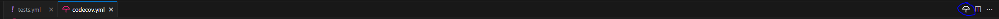

# CodeCov Integration Guide

This guide will walk you through setting up CodeCov to track your test coverage and generate reports using a GitHub Action pipeline. It will make use of a forked [Django](https://www.djangoproject.com/) web framework [repository](https://github.com/django/django) as an example. Adjusting these steps will allow you to add CodeCov integration with any other application in a GitHub repository that already generates code coverage reports.


---

## Why Use CodeCov?

CodeCov is a tool for visualizing code coverage to help developers track the effectiveness of their tests. By integrating it into your CI/CD pipeline, you can ensure continuous monitoring of code coverage metrics across branches and pull requests, encouraging higher code quality.

## Prerequisites

* A GitHub account
* Fork of the Django [repository](https://github.com/django/django) or another existing application repository where coverage reports are generated
* A CodeCove account, create a free trial account [here](https://about.codecov.io/codecov-free-trial/)

---

## Set Up CodeCov

* **Create a CodeCov Account:**  
[Sign up](https://about.codecov.io/codecov-free-trial/) for a CodeCov account and follow the official [quick start guide](https://docs.codecov.com/docs/quick-start) which will walk you through creating an account and installing the GitHub application. CodeCov integrates with platforms like GitHub, Bitbucket, and GitLab, allowing seamless integration into your development workflow.

* **Install the GitHub Application:**  
This guide will focus on using GitHub, install the CodeCov GitHub [application](https://github.com/apps/codecov) and provide access to the repository you would like to manage. This will allow CodeCov to access your repository and provide automatic reporting on pull requests.

* **Get Your CodeCov Upload Token:**  
Once you’ve created an account and connected your repository, obtain the upload token for your project. You’ll need this token to securely upload coverage reports to CodeCov.

---

## Generate Coverage Report Locally

Once CodeCov is set up, the next step is to generate a coverage report locally to ensure everything works before automating it via GitHub Actions.

In a terminal, clone the forked Django repo:

```bash
git clone https://github.com/<YourGitHubName>/django.git django-repo
```

Navigate into the newly cloned repository:

```bash
cd django-repo
```

### Install Python Packages

Create a new virtual environment:

```bash
python -m venv ~/venvs/django
```

Activate the virtual environment:

```bash
source ~/venvs/django/bin/activate
```

If you’re following along using the Django project, ensure packages are installed by running:

```bash
pip install -e .
```

Otherwise ensure that all required packages to run the tests in your repository are installed.

### Install Test Dependencies

Install the test dependencies with:

```bash
pip install -r tests/requirements/py3.txt
```

### Install Coverage

Additionally, install the `coverage` package, which will generate the coverage reports:

```bash
pip install coverage
```

### Run Tests with Coverage

Run the test suite. Adjust the paths as necessary to fit your project’s structure:

```bash
coverage run ./tests/runtests.py --settings=test_sqlite
```

### Combine Coverage Data (if needed)

If you have multiple coverage reports (from different test runs), combine them into a single report:

```bash
coverage combine
```

### Generate Coverage Report

Generate an XML-format coverage report by running:

```bash
coverage xml
```

This is the point at which you would usually stop to inspect the coverage report that was generated by opening the `coverage.xml` file.

If you view the content of `coverage.xml` you will see a report that looks something like this:

```xml
<?xml version="1.0" ?>
<coverage version="7.6.1" timestamp="1727936331112" lines-valid="196017" lines-covered="64094" line-rate="0.327" branches-covered="0" branches-valid="0" branch-rate="0" complexity="0">
 <!-- Generated by coverage.py: https://coverage.readthedocs.io/en/7.6.1 -->
 <!-- Based on https://raw.githubusercontent.com/cobertura/web/master/htdocs/xml/coverage-04.dtd -->
 <sources>
  <source>/path/to/django</source>
 </sources>
 <packages>
  <package name="django" line-rate="0.325" branch-rate="0" complexity="0">
   <classes>
    <class name="__init__.py" filename="django/__init__.py" complexity="0" line-rate="1" branch-rate="0">
     <methods/>
     <lines>
      <line number="1" hits="1"/>
      ...
     </lines>
    </class>
    <class name="__main__.py" filename="django/__main__.py" complexity="0" line-rate="0.6667" branch-rate="0">
     <methods/>
     <lines>
      <line number="7" hits="1"/>
      ...
     </lines>
    </class>
    <class name="shortcuts.py" filename="django/shortcuts.py" complexity="0" line-rate="0.1846" branch-rate="0">
     <methods/>
     <lines>
      <line number="7" hits="1"/>
      ...
     </lines>
    </class>
   </classes>
  </package>
 </packages>
</coverage>
```

This is a simplified view of the coverage file that will actually be generated. In order to properly understand what is being reported, you need to understand the structure and the meaning of the elements and attributes within the XML. Here's an explanation of the tags and what they mean.

```xml
<coverage version="7.6.1" timestamp="1727936331112" lines-valid="196017" lines-covered="64094" line-rate="0.327" branches-covered="0" branches-valid="0" branch-rate="0" complexity="0">
```

* **version:** Version of the coverage tool
* **timestamp:** When the report was generated
* **lines-valid:** Total number of lines that could be covered
* **lines-covered:** Number of lines that were actually covered
* **line-rate:** Ratio of covered lines to valid lines
* **branches-covered, branches-valid, branch-rate:** Similar metrics for branches (not used in this example)
* **complexity:** Complexity metric (not used in this example)

```xml
<sources>
  <source>/path/to/django</source>
</sources>
```

Lists the source directories. There may be multiple sources if you are running tests for multiple applications or libraries.

```xml
<packages>
  <package name="django" line-rate="0.325" branch-rate="0" complexity="0">
```

* **name:** Name of the package
* **line-rate, branch-rate, complexity:** Coverage metrics for the package

```xml
<classes>
  <class name="__init__.py" filename="django/__init__.py" complexity="0" line-rate="1" branch-rate="0">
```

* **name:** Name of the class or file being tested
* **filename:** Path to the file
* **complexity, line-rate, branch-rate:** Coverage metrics for the class/file

```xml
<methods/>
```

Placeholder for method-level coverage (empty in this example).

```xml
<lines>
  <line number="1" hits="1"/>
  ...
</lines>
```

* Each `<line>` element represents a line of code
* **number:** Line number in the source file
* **hits:** Number of times the line was executed

---

## Running CodeCov in a GitHub Action

To automate coverage tracking, you’ll want to run CodeCov as part of your CI pipeline using GitHub Actions.

### GitHub Actions Workflow

Open the existing workflow configuration file at `.github/workflows/tests.yml` in your Django repository. This file will define the steps for running tests, generating coverage reports, and uploading those reports to CodeCov.

### Edit the Workflow

Below is the workflow configuration for the Django repository:

```yaml
name: Tests

on:
  pull_request:
    paths-ignore:
      - 'docs/**'
  push:
    branches:
      - main
    paths-ignore:
      - 'docs/**'

concurrency:
  group: ${{ github.workflow }}-${{ github.ref }}
  cancel-in-progress: true

permissions:
  contents: read

jobs:
  windows:
    runs-on: windows-latest
    strategy:
      matrix:
        python-version:
          - '3.12'
    name: Windows, SQLite, Python ${{ matrix.python-version }}
    steps:
      - name: Checkout
        uses: actions/checkout@v4
      - name: Set up Python
        uses: actions/setup-python@v5
        with:
          python-version: ${{ matrix.python-version }}
          cache: 'pip'
          cache-dependency-path: 'tests/requirements/py3.txt'
      - name: Install and upgrade packaging tools
        run: python -m pip install --upgrade pip setuptools wheel
      - run: python -m pip install -r tests/requirements/py3.txt -e .
      - name: Run tests
        run: python tests/runtests.py -v2

  javascript-tests:
    runs-on: ubuntu-latest
    name: JavaScript tests
    steps:
      - name: Checkout
        uses: actions/checkout@v4
      - name: Set up Node.js
        uses: actions/setup-node@v4
        with:
          node-version: '20'
          cache: 'npm'
          cache-dependency-path: '**/package.json'
      - run: npm install
      - run: npm test
```

You'll need to make some small changes additions to generate and upload the coverage report.

Replace the the `Install and upgrade packaging tools` section with:

```yaml
name: Install and upgrade packaging tools
  run: python -m pip install --upgrade pip setuptools wheel
  - run: python -m pip install -r tests/requirements/py3.txt -e .
  - run: python -m pip install coverage
```

Only one new command was added: `python -m pip install coverage`.

Then edit the `Run Tests` step with:

```yaml
- name: Run tests and generate code coverage reports
  run: coverage run ./tests/runtests.py --settings=test_sqlite
```

Upload the coverage report using CodeCov’s GitHub Action. Add this step to your GitHub Actions workflow:

```yaml
- name: Combine coverage reports
  run: coverage xml
- name: Upload results to Codecov
  uses: codecov/codecov-action@v4
  with:
    token: ${{ secrets.CODECOV_TOKEN }}
```

This step makes use of the CodeCov GitHub application to collect the coverage report and upload it to CodeCov so that it can be processed into visualizations and reports.

After these edits, the workflow will now additionally install the `coverage` package, run the tests using `coverage`, combine any result files, generate an XML file, and upload that file to CodeCov, ready for inspection.

## Upload Coverage Report

### Commit and Push Your Changes

After creating the workflow file, commit and push your changes to trigger the workflow:

 ```bash
 git add .
 git commit -m "Add CodeCov integration"
 git push origin main
 ```

### Monitor the GitHub Actions Pipeline

Open the **Actions** tab in your GitHub repository to monitor the status of the CI pipeline. Make sure that all steps, especially the CodeCov upload, complete successfully.


### Verify Coverage Upload

After the pipeline completes, check the CodeCov dashboard to verify that the coverage report was uploaded correctly.

---

## Configure CodeCov

Add a CodeCov YAML configuration file to configure the views of your project in CodeCov.

* Create a file named `codecov.yml` in the root directory of your project
* Add the necessary configuration settings to the `codecov.yml` file. Below is an example configuration:

```yaml
coverage:
  status:
    project:
      default:
        target: 30%
    patch:
      default:
        target: 30%

comment:
  layout: "reach, diff, flags, files"
```

This configuration sets a target coverage of 30% for both the entire project and individual patches, and specifies the layout for comments on pull requests.

To ensure that there are no errors in the `codecov.yml` file, it is best to make use of the CodeCov VSCode [extension](https://marketplace.visualstudio.com/items?itemName=Codecov.codecov) to assist with validation.

Install the extension and use the icon at the top of the page to run the validation. A notice will appear with the results.




You can now commit these changes and view the changes in you CodeCov dashboard after the pipelines have completed.

To see some more advanced usage of the CodeCov YAML, see the [documentation](https://docs.codecov.com/docs/codecov-yaml).

---
