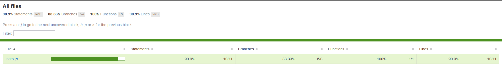
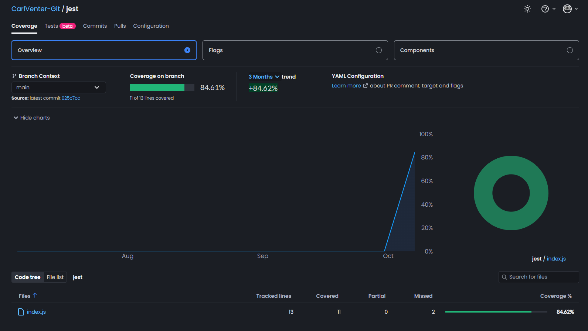
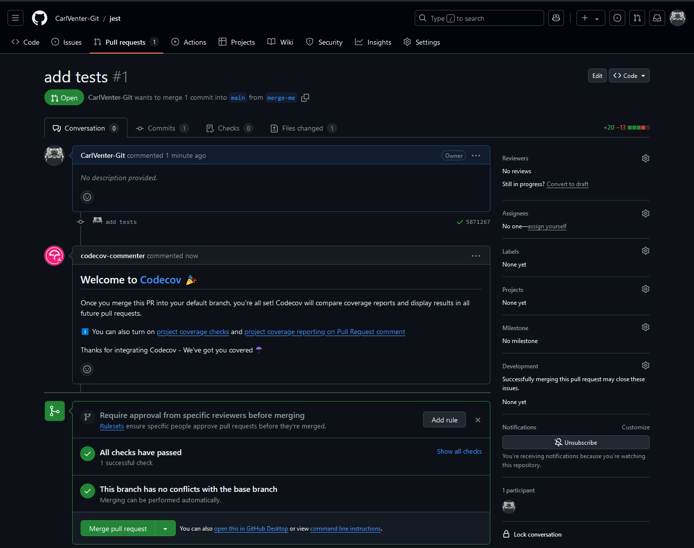
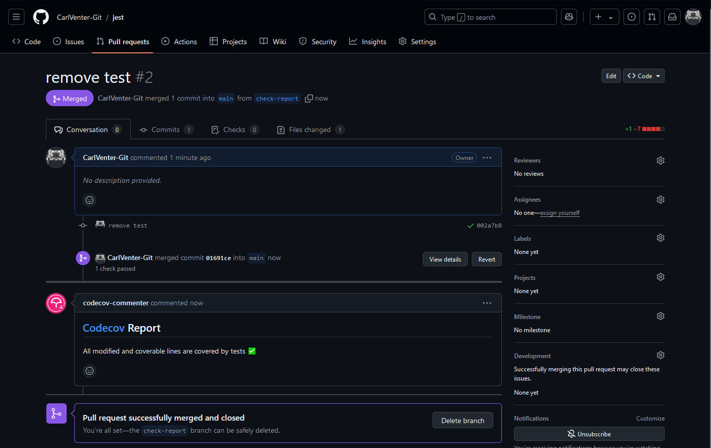

# Generate Code Coverage Reports with Jest

If you’re using [Jest](https://jestjs.io/) for testing in your JavaScript projects, you may have heard about code coverage reports. These reports give insight into how much of your codebase is being tested, and can be a valuable tool for improving the quality and reliability of your code.

In this article, we’ll walk through how to set up, generate, and interpret Jest code coverage reports and extend their functionality to better share and make decisions. This will all help you to maximize the effectiveness of your tests.

## What is Code Coverage?

Code coverage measures the percentage of your code that is executed when tests are run. It helps identify untested parts of your codebase, guiding you on where to focus additional testing. Coverage metrics often include:

* **Statement Coverage:** Checks if each statement in your code has been executed
* **Branch Coverage:** Tests whether every possible branch (e.g., `if/else`) has been executed
* **Function Coverage:** Ensures each function in your code has been invoked
* **Line Coverage:** Determines if each line of code has been executed

Jest, a popular JavaScript testing framework, supports code coverage out of the box, making it simple to get started.

---

## Setting Up Jest for Code Coverage

Before generating coverage reports, ensure you have Jest installed in your project. If you don’t have it yet, you can install it using npm:

```bash
npm install --save-dev jest
```

To enable code coverage, you can modify the `package.json` file or pass a flag directly when running Jest.

### Add Code Coverage Command in package.json

You can modify the test script in your `package.json` file to include coverage by default:

```json
{
  "scripts": {
    "test": "jest --coverage"
  }
}
```

Which will run the tests and generate the coverage report when you run:

```bash
npm test
```

### Run Jest with Coverage Flag

Alternatively, you can run the command directly from your terminal:

```bash
npx jest --coverage
```

This will generate a detailed code coverage report each time you run your tests.

---

## Understanding the Coverage Report

Once the tests run, Jest outputs a coverage summary to the console, and it creates a coverage directory in your project with an HTML report. Following is an explanation of what the outputs mean. ++

### Console Output

The console output will look something like this:

```bash
C:\path\to\Jest\repo>npx jest --coverage
 PASS  ./index.test.js
  Index.html Tests
    √ true (4 ms)
    √ false (1 ms)
    √ true
    √ true (1 ms)

----------|---------|----------|---------|---------|-------------------
File      | % Stmts | % Branch | % Funcs | % Lines | Uncovered Line #s
----------|---------|----------|---------|---------|-------------------
All files |    90.9 |    83.33 |     100 |    90.9 |
 index.js |    90.9 |    83.33 |     100 |    90.9 | 12
----------|---------|----------|---------|---------|-------------------
Test Suites: 1 passed, 1 total
Tests:       4 passed, 4 total
Snapshots:   0 total
Time:        0.626 s, estimated 1 s
Ran all test suites.
```

* **Stmts:** Percentage of statements executed
* **Branch:** Percentage of branch paths (e.g., if/else conditions) tested
* **Funcs:** Percentage of functions called
* **Lines:** Percentage of lines executed

Uncovered lines are listed on the right, helping you find areas that may need additional tests.

### HTML Report

For a more detailed analysis, open the HTML report found at `coverage/lcov-report/index.html` in your browser. This visual representation allows you to:

* Navigate through files and folders
* See color-coded indicators showing covered (green) and uncovered (red) lines of code
* Inspect each file for specific areas where tests are missing



---

## Improving Code Coverage

Once you have a report, you may find gaps in your tests. Here are some tips to properly address them

### Increase Branch Coverage

Branch coverage often lags because tests may not cover all conditions. Consider testing both true and false outcomes for every conditional statement.

### Test Edge Cases

Think about edge cases, such as:

* Empty inputs
* Extremely large values
* Unexpected user behaviors

Adding these tests can increase your statement, branch, and line coverage.

### Mock Dependencies

For functions that rely on external APIs or other modules, use mocks to simulate different scenarios. Jest has useful mocking capabilities through functions like `jest.fn()` and `jest.mock()`, which help test your code in isolation.

Find more information about Mock Functions in Jest, refer to the Jest [documentation](https://jestjs.io/docs/mock-functions).

---

## Advanced Configuration for Jest Code Coverage

You can customize Jest’s code coverage behavior using the `jest.config.js` file or configuration options within your `package.json`. Below are some useful settings.

### Exclude Files and Directories

If there are files or directories you want to exclude from coverage reports (e.g., configuration files, mocks, or utilities), you can use the `coveragePathIgnorePatterns` option:

```js
// jest.config.js
module.exports = {
  collectCoverage: true,
  coveragePathIgnorePatterns: [
    "/node_modules/",
    "/src/utils/"
  ]
};
```

### Set Thresholds

To enforce a minimum level of coverage, use the coverageThreshold option. If coverage falls below the defined threshold, Jest will fail the test run:

```js
// jest.config.js
module.exports = {
  collectCoverage: true,
  coverageThreshold: {
    global: {
      branches: 80,
      functions: 90,
      lines: 90,
      statements: 90
    }
  }
};
```

### Coverage Report Types

Jest supports multiple report types, such as text, html, lcov, and json. You can specify which reports Jest should generate using the `coverageReporters` option:

```js
// jest.config.js
module.exports = {
    collectCoverage: true,
    coverageReporters: ["json", "lcov", "text", "html"]
};
```

This flexibility allows you to integrate Jest reports with CI/CD tools like Codecov, which visualizes and tracks coverage over time.

---

## Automating Coverage Reports in CI/CD

If you use a CI/CD service like GitHub Actions, GitLab CI, or Jenkins, you can automate code coverage checks to ensure code quality continuously. Here's a basic example using GitHub Actions:

```yaml
name: CI
on:
  push:
    branches: [ "main" ]
  pull_request:
    branches: [ "main" ]
jobs:
  test:
    runs-on: ubuntu-latest
    steps:
      - name: Checkout code
        uses: actions/checkout@v4
      - name: Set up Node.js
        uses: actions/setup-node@v4
        with:
          node-version: '22'
      - name: Install dependencies
        run: npm install
      - name: Run tests with coverage
        run: npm test -- --coverage
```

---

## Codecov Integration with Jest Coverage Reports

Integrating Jest with Codecov enables you to track and visualize the code coverage metrics you generate over time. Codecov is a service that integrates with existing CI/CD pipelines, providing insights into your testing coverage.

Below are the steps to set up and integrate Codecov with your existing Jest setup.

### Set Up Codecov for Your Repository

First, [create](https://about.codecov.io/codecov-free-trial/) an account on Codecov and link it to your version control platform, refer to the [quick start guide](https://docs.codecov.com/docs/quick-start) for more details on these steps.  
Codecov will generate a unique token for your project, which you will need to save as a **Repository Secret** to upload the coverage reports securely.

### Generate Coverage Reports with Jest

Ensure Jest is generating reports in a format compatible with Codecov. By default, Jest produces `lcov` reports, which Codecov can read. Update your Jest configuration (`jest.config.js`) if necessary:

```js
// jest.config.js
module.exports = {
  collectCoverage: true,
  coverageDirectory: "coverage",
  coverageReporters: ["text", "lcov", "json", "html"]
};
```

**NOTE:** Make sure the `coverageDirectory` is set to a location that your CI environment can access (usually, the default coverage folder works fine).

### Add Codecov to Your CI Pipeline

In your GitHub Actions CI configuration file, use the Codecov application to pass the coverage report to Codecov. Below is an example of a GitHub Actions `workflow.yml`:

```yaml
name: CI
on:
  push:
    branches: [ "main" ]
  pull_request:
    branches: [ "main" ]
jobs:
  test:
    runs-on: ubuntu-latest
    steps:
      - name: Checkout code
        uses: actions/checkout@v4
      - name: Set up Node.js
        uses: actions/setup-node@v4
        with:
          node-version: '22'        
      - name: Install dependencies
        run: npm install 
      - name: Run tests with coverage
        run: npm test -- --coverage
      - name: Upload results to Codecov
        uses: codecov/codecov-action@v4
        with:
          token: ${{ secrets.CODECOV_TOKEN }}
```

Explanation of the steps:

* **Checkout code:** Retrieves your repository code
* **Set up Node.js:** Configures the environment with the desired Node.js version
* **Run tests with coverage:** Executes your tests with the --coverage flag, generating the coverage report
* **Upload results to Codecov:** Uses the Codecov GitHub application to send the coverage report

**NOTE:** The value for ``${{ secrets.CODECOV_TOKEN }}`` can be found in your Codecov project settings (store this token securely as a secret in your CI environment).

### View Coverage Reports on Codecov

After setting up Codecov in your CI pipeline, every new build will upload coverage data. You can access the reports through your Codecov dashboard, where you’ll find:

* A summary of your project’s coverage metrics
* A breakdown of coverage per file, showing which files are under-tested
* Visualizations of coverage changes between commits, branches, or pull requests



### Pull Request Reports

After you have installed the GitHub application and connected your Repo to Codecov, you will see the a message when you open you next pull request to the `main` branch.



And every subsequent pull request that is opened will have a comment added by the Codecov bot that gives a quick summary of your coverage.



### Enforcing Coverage Thresholds

Codecov lets you enforce minimum coverage thresholds, so if coverage drops below a set percentage, your build can fail automatically. Add a `codecov.yml` file to your repository’s root to configure these settings:

```yaml
coverage:
  status:
    project:
      default:
        target: 80%
    patch:
      default:
        target: 80%
```

In this example:

* **project:** sets the target for overall project coverage.
* **patch:** sets the target for new code introduced in pull requests.

These thresholds ensure that new changes do not decrease the code coverage below acceptable levels.

## Conclusion

Jest code coverage reports are powerful tools for enhancing your testing strategy and maintaining high code quality. By understanding how to set up, interpret, and optimize these reports, you can identify gaps in your tests and ensure your codebase remains reliable.

Integrating Codecov with Jest not only provides visibility into your test coverage but also helps enforce standards and prevents regressions. By setting up Codecov, you leverage an automated solution that highlights coverage gaps, monitors code quality trends, and ensures that your codebase remains robust over time.

By following these steps, you’ll have a streamlined process for managing code coverage, ensuring your tests are comprehensive and your codebase stays reliable.

### Additional Resources

* [Jest](https://jestjs.io/)
* [Jest Documentation](https://jestjs.io/docs/getting-started)
* [Codecov](https://about.codecov.io/)
* Codecov GitHub Application

This guide should give you a solid foundation in Jest code coverage, helping you implement best practices and achieve greater test coverage in your projects.
